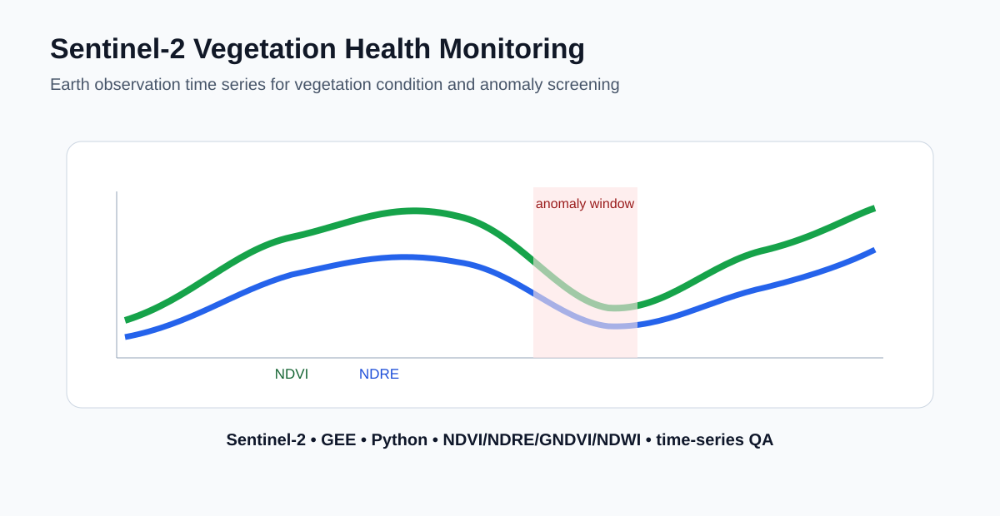
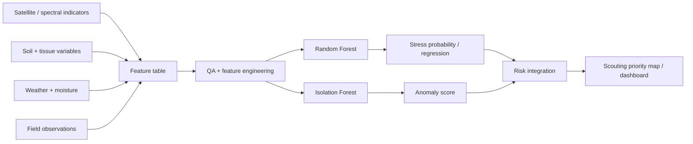

<h1 align="center">GeoAI Multi-Sensor Crop Stress Intelligence</h1>
<p align="center"><strong>Satellite + UAV + Hyperspectral Data Fusion for Precision Agriculture</strong></p>
<p align="center">From Earth observation to interpretable crop-stress predictions and scouting priorities.</p>

<p align="center">
  <a href="#run-the-spatial-validation-demo">Run demo</a> ·
  <a href="multisensor/README.md">Multi-sensor methodology</a> ·
  <a href="gee/south_florida_real_case.js">Real Sentinel-2 workflow</a> ·
  <a href="https://github.com/belbasepriyanka">Author's GitHub</a>
</p>



> **Data transparency:** This repository provides a real public Sentinel-2 processing script and a separate synthetic multi-sensor ML demonstration. The infographic metrics (0.87 accuracy, 0.85 F1, 0.92 ROC-AUC and 0.18 RMSE) are illustrative and are **not** measured performance from the committed workflow. Consult generated `validation_metrics.json` for reproducible demonstration results. No field-validated multi-sensor model or operational agronomic advice is claimed.

## The questions this project addresses

- Where is potential crop stress emerging across an area of interest?
- How uncertain is the model's predicted stress probability?
- Which inputs are associated with the modeled risk?
- Which locations should be inspected first by a field specialist?

## Five data streams, one decision-support workflow

| Data stream | Representative variables | Current public implementation |
|---|---|---|
| Satellite / Sentinel-2 | NDVI, NDRE, EVI, NDWI, vegetation moisture indices | Real Level-2A South Florida Earth Engine script (NDVI, NDRE, NDMI, GNDVI); synthetic NDVI/NDRE/EVI/NDWI features in multi-sensor demo |
| UAV | Canopy structure and texture | Simulated features; real-data integration designed, not yet verified |
| Hyperspectral | Red-edge slope, NIR reflectance, water-sensitive indicators | Simulated features; no measured hyperspectral cube in public demo |
| Soil and field | Soil moisture, soil N, field observations | Simulated features; ground-truth integration is future work |
| Weather | Rainfall and temperature | Simulated features; time-aligned weather ingestion is future work |

**Pipeline:** sensor inputs → QA/QC and feature engineering → spatially grouped Random Forest validation → held-out stress probabilities → uncertainty proxy and feature importance → risk classes → GIS-ready scouting-priority points.

## Run the spatial-validation demo

From the repository root, using Python 3.11 or newer:

```bash
pip install -r requirements.txt
python multisensor/run_demo.py
python -m pytest multisensor/tests -q
```

The standalone workflow in [`multisensor/run_demo.py`](multisensor/run_demo.py) generates fictional spatial samples, keeps the same spatial blocks out of training and validation, and exports:

| Output | Purpose |
|---|---|
| `multisensor/outputs/spatial_cv_predictions.csv` | Held-out probabilities, risk classes, block IDs and priorities |
| `multisensor/outputs/scouting_priority_points.geojson` | Open in ArcGIS Pro or QGIS to inspect fictional priority points |
| `multisensor/outputs/validation_metrics.json` | Synthetic accuracy, F1, ROC-AUC, Brier score and fold membership |
| `multisensor/outputs/feature_importance.csv` | Exploratory Random Forest feature rankings |
| `multisensor/outputs/synthetic_multisensor_inputs.csv` | Generated features, fictional coordinates and labels |

**Validation:** Five-fold GroupKFold with disjoint spatial blocks reduces direct spatial group overlap. The provided uncertainty measure is tree disagreement, not calibrated uncertainty; feature importance is association, not proof of a physical stress driver.

The existing [real Sentinel-2 case study](docs/real_sentinel2_case_study.md) demonstrates a separate public-data pathway. It does not automatically feed real imagery into the synthetic model. See the [multi-sensor methods and real-data ingestion contract](multisensor/README.md).

---

## Existing satellite and nutrient-stress workflows

> **Portfolio note:** GitHub commit dates reflect when public code and documentation were published or maintained. They are not intended to represent the start date of the underlying research or analytical work.

## What this project demonstrates

| Capability | Implementation |
|---|---|
| Multi-source geospatial integration | Sentinel-2 vegetation indices, spectral indicators, soil/tissue variables, weather and moisture features |
| Feature engineering | NDVI, NDRE, NDMI, GNDVI, red-edge slope, NIR/SWIR and environmental predictors |
| Machine learning | Random Forest classification/regression and Isolation Forest anomaly detection |
| Model evaluation | reproducible train/evaluate workflow, feature importance and risk interpretation |
| Operational output | 0–100 scouting score and Normal / Monitor / Inspect prioritization |
| Reproducibility | scripts, notebook, tests, figures, results and version-controlled workflow |
| Production thinking | separation of ingestion, feature construction, modeling, scoring and dashboard delivery |

## Research architecture

The broader research workflow motivating this repository combines **Sentinel-2 imagery, UAV canopy information, hyperspectral red-edge/NIR/water-sensitive features, soil moisture, field observations, rainfall and temperature**. Because unpublished field and spectral measurements are not distributed publicly, this repository separates:

1. a **real public Sentinel-2 workflow**, and
2. a **synthetic demonstration dataset** used to show the machine-learning and decision-support architecture.

This keeps the software reproducible without presenting demonstration values as measured research data.

## Real Sentinel-2 workflow

The repository includes a real **Sentinel-2 Level-2A South Florida vegetation-monitoring workflow** using `COPERNICUS/S2_SR_HARMONIZED` in Google Earth Engine.

- [`gee/south_florida_real_case.js`](gee/south_florida_real_case.js)
- [`docs/real_sentinel2_case_study.md`](docs/real_sentinel2_case_study.md)
- SCL-based cloud, cloud-shadow and cirrus masking
- NDVI, NDRE, NDMI and GNDVI
- seasonal median products
- vegetation-index time series
- export-ready rasters for downstream GIS/Python/ML workflows

The public AOI is a demonstration region. Field-specific agronomic interpretation requires a verified field boundary and corresponding ground observations.

## Machine-learning workflow



## Technical highlights

- integrates soil N/P/K, tissue N/P/K, weather, canopy moisture and spectral predictors
- Random Forest stress classification
- tissue-N regression from nutrient + spectral variables
- Isolation Forest spectral anomaly scoring
- feature-importance analysis
- uncertainty-aware risk interpretation
- 0–100 scouting-priority score
- Sentinel-2 preprocessing in Google Earth Engine
- Streamlit decision-support dashboard
- reproducible scripts, notebook, figures, results and tests

## Visual outputs

| Nutrient–spectral relationship | Stress classification |
|---|---|
|  |  |


## Repository structure

```text
sentinel2-vegetation-health-monitoring/
├── dashboard/      # Streamlit decision-support interface
├── data/           # public demonstration data
├── docs/           # methodology and real-data case study
├── figures/        # model and decision-support visuals
├── gee/            # real Sentinel-2 Earth Engine workflow
├── notebooks/      # exploratory/reproducible analysis
├── results/        # machine-readable outputs
├── scripts/        # runnable workflow entry points
├── src/            # reusable analysis components
└── tests/          # workflow validation
```

## Run locally

```bash
pip install -r requirements.txt
python scripts/run_demo.py
python -m pytest -q
streamlit run dashboard/app.py
```

For the real satellite-data workflow, open [`gee/south_florida_real_case.js`](gee/south_florida_real_case.js) in Google Earth Engine.

## Production relevance

This project is structured around the same steps required in operational geospatial ML: **data ingestion → QA/QC → feature engineering → model training → validation → inference → uncertainty/risk interpretation → user-facing output**. The architecture is designed to be extendable to larger field collections, additional sensors and production-scale batch inference.

## Scientific boundary

Public CSV values, risk scores and model metrics in the demonstration pathway are synthetic. They are not unpublished research measurements, crop diagnoses or fertilizer recommendations. Operational deployment requires field-specific ground truth, independent validation and appropriate agronomic calibration.

## Author

**Priyanka Belbase**  
Geospatial Data Science | Remote Sensing | GeoAI | Machine Learning
