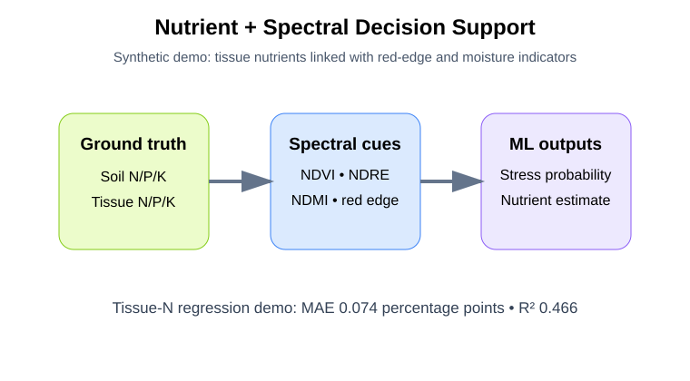
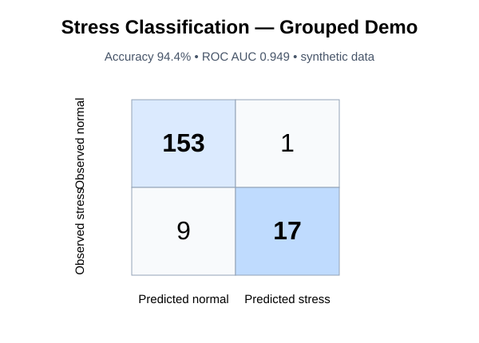
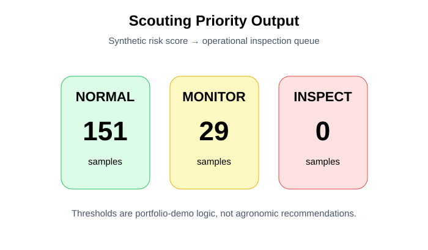
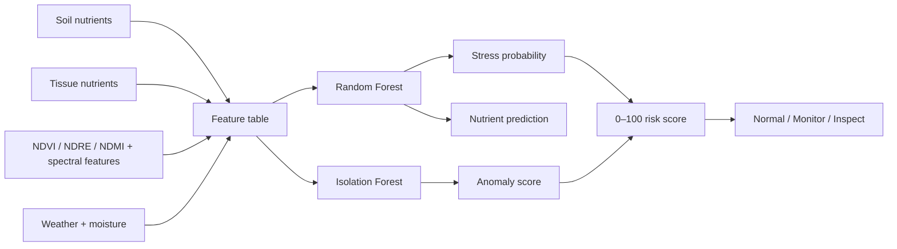

# Dragon Fruit Nutrient & Stress Decision Support

**Soil + tissue + hyperspectral/vegetation indicators + ML + precision agriculture**

This repository extends Sentinel-2 vegetation monitoring into a complete **nutrient/stress analytics and scouting decision-support demonstration**.

> **Transparency:** all public CSV values, risk scores, and model metrics are synthetic demonstration outputs. They are not unpublished research measurements and are not fertilizer or crop-diagnosis recommendations.

## Real public-data extension

The repository also includes a **real Sentinel-2 Level-2A South Florida vegetation-monitoring workflow** using the official `COPERNICUS/S2_SR_HARMONIZED` Earth Engine collection.

- Real Earth Engine script: [`gee/south_florida_real_case.js`](gee/south_florida_real_case.js)
- Case-study documentation: [`docs/real_sentinel2_case_study.md`](docs/real_sentinel2_case_study.md)
- SCL-based cloud/cloud-shadow/cirrus masking
- NDVI, NDRE, NDMI, and GNDVI
- seasonal median products
- vegetation-index time series
- export-ready index rasters for GIS/Python/ML

The AOI is a public demonstration region and should be replaced with a verified field boundary for agronomic interpretation.

## Technical highlights

- Integrates soil N/P/K, tissue N/P/K, weather, canopy moisture, NDVI, NDRE, NDMI, red-edge slope, NIR, and SWIR features
- Random Forest stress classification
- Tissue-N regression from nutrient + spectral variables
- Isolation Forest spectral anomaly scoring
- 0–100 scouting risk score and Normal / Monitor / Inspect priority
- Sentinel-2 Google Earth Engine workflow
- **real public Sentinel-2 case-study pathway**
- Streamlit decision-support dashboard
- reproducible script, notebook, figures, results, and tests

## Visual results

| Nutrient–spectral relationship | Stress classification |
|---|---|
|  |  |



## Workflow



## Run

```bash
pip install -r requirements.txt
python scripts/run_demo.py
python -m pytest -q
streamlit run dashboard/app.py
```

For the real public-data workflow, open [`gee/south_florida_real_case.js`](gee/south_florida_real_case.js) in Google Earth Engine.

## Decision question

**Can field, nutrient, and spectral indicators be combined into a reproducible early-warning workflow that prioritizes which plants or fields should be inspected first?**

## Research context

This project reflects ongoing work combining plant and soil nutrients, spectral indicators, vegetation indices, environmental measurements, GIS and remote sensing for crop monitoring and decision support.

## Scientific boundary

The dashboard is a decision-support demonstration, not a nutrient diagnosis. The Earth Engine extension uses real Sentinel-2 imagery, but field-specific agronomic inference still requires a verified field boundary, crop-specific ground truth, calibration, and independent validation.
