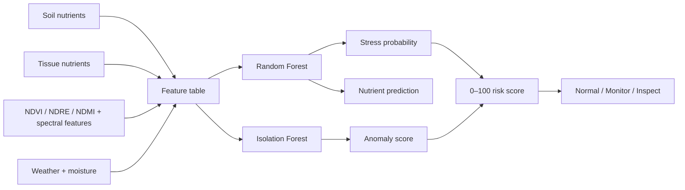

# Dragon Fruit Nutrient & Stress Decision Support

**Soil + tissue + hyperspectral/vegetation indicators + ML + precision agriculture**

**Timeline:** Research development **2024–2026** • Public GitHub portfolio implementation **2026**

This repository extends Sentinel-2 vegetation monitoring into a complete **nutrient/stress analytics and scouting decision-support demonstration**.

> **Transparency:** all public CSV values, risk scores, and model metrics are synthetic demonstration outputs. They are not unpublished research measurements and are not fertilizer or crop-diagnosis recommendations.

## Recruiter summary

- Integrates soil N/P/K, tissue N/P/K, weather, canopy moisture, NDVI, NDRE, NDMI, red-edge slope, NIR, and SWIR features
- Random Forest stress classification
- Tissue-N regression from nutrient + spectral variables
- Isolation Forest spectral anomaly scoring
- 0–100 scouting risk score and Normal / Monitor / Inspect priority
- Sentinel-2 Google Earth Engine workflow
- Streamlit decision-support dashboard
- reproducible script, notebook, figures, results, and tests

## Visual results

| Nutrient–spectral relationship | Stress classification |
|---|---|
|  |  |


## Workflow



## Run

```bash
pip install -r requirements.txt
python scripts/run_demo.py
python -m pytest -q
streamlit run dashboard/app.py
```

## Decision question

**Can field, nutrient, and spectral indicators be combined into a reproducible early-warning workflow that prioritizes which plants or fields should be inspected first?**

## Scientific boundary

The dashboard is a decision-support demonstration, not a nutrient diagnosis. Operational transfer requires crop-specific calibration, field/lab ground truth, and independent validation.
